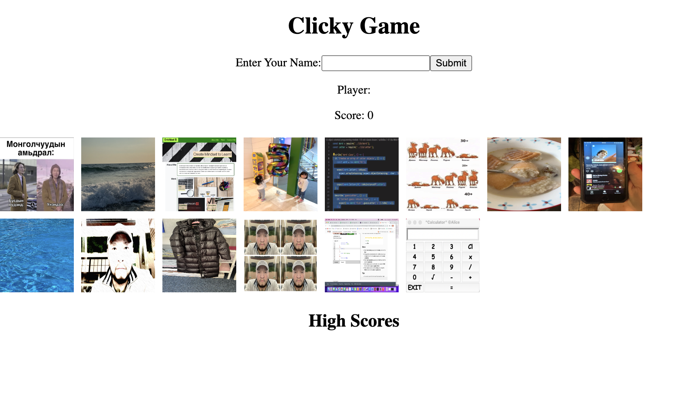

# Clicky-Game.
## Description.
This game promotes memory improvement. When you click picture the application shuffles the images, and you need to click again the image, everytime you click the image it must be different image, once you have clicked the same image the score will show how many images you have clicked and the game will start again. 
### Used Technologies.
* HTML,
* CSS,
* JavaScript,
* React.

